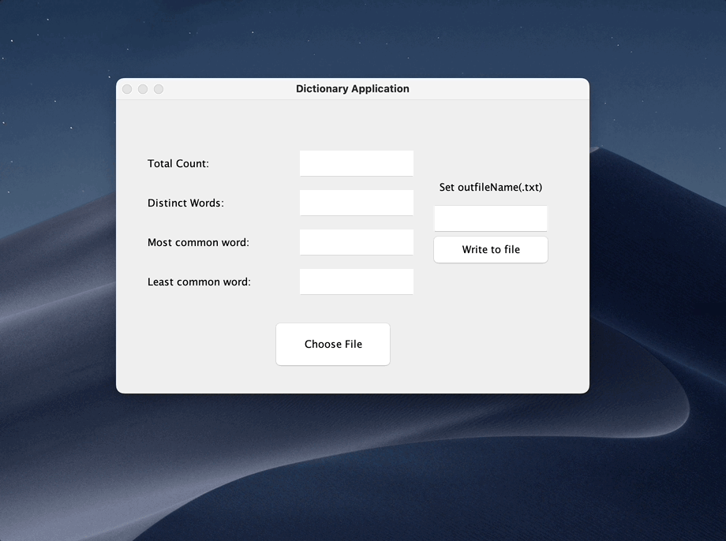

# **Demo**

# **Purpose**

This project aims to take in a text document and read in and count 
all occurrences of each word. In the completed project, the user can either give
a command-line argument to work inside the terminal or use the gui application
by passing no arguments. Both versions will display the total word count, 
distinct word count, most common word, and least common word. In our terminal 
application, data will be automatically written out to an outfile. In our gui 
application, the user can save or only view the data. In both versions,
the outfile will contain the total word count, each distinct occurrence of a word in 
dictionary order, and its count.

# **Contents**

For this project we will have 7 files, following (Model View Controller) model

1. MainDriver.java - Main entry point of program.
2. FileFunctions.java - Functions to pull the information needed for the gui.
3. Gui.java - Gui build
4. EventController.java - Handles button clicks from gui.
5. .gitignore
6. test.txt - Starter file to play around with.
7. booklong.txt - A longer text file to analyze.

# **How to use**

Note: Two ways to run this program

## **Terminal application**

### **1st Step**

Compilation: javac MainDriver.java

### **2nd Step**

Run Program: java MainDriver foobar.txt

## **Gui application**

### **1st Step**

Compilation: javac MainDriver.java

### **2nd Step** 

Run Program: java MainDriver

